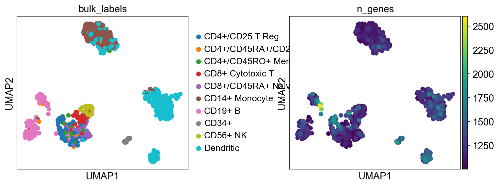
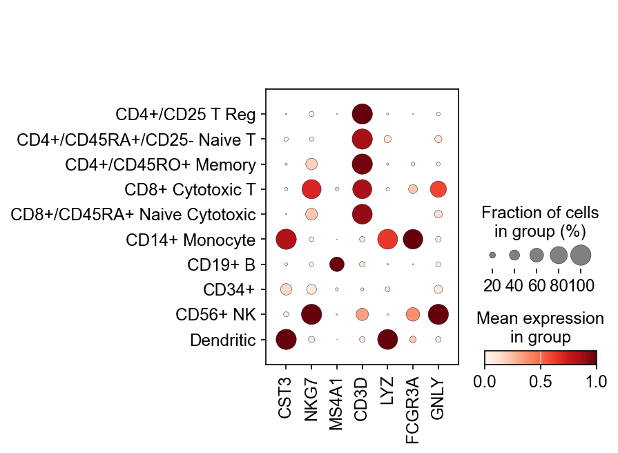
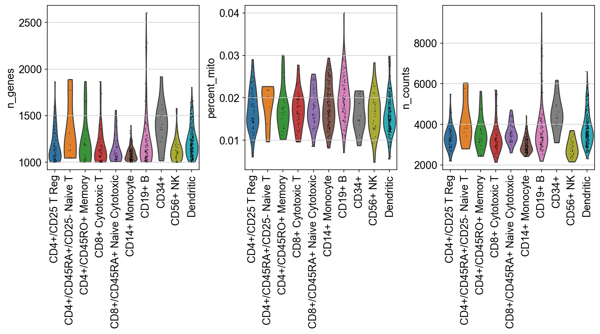

# Team.SEE.Tutorial

This repository is a course-project tutorial on Scanpy, a Python toolkit for analyzing single-cell biological data, and AnnData, the annotated data structure that Scanpy uses to organize expression matrices, cell metadata, gene metadata, embeddings, and analysis results.

## Scanpy and AnnData

Scanpy is an open-source Python package for scalable single-cell analysis. It was introduced by F. Alexander Wolf, Philipp Angerer, and Fabian J. Theis in Genome Biology in 2018 as a toolkit for large-scale single-cell gene expression analysis. The original paper presented Scanpy alongside AnnData, a data structure designed to store annotated biological matrices in a way that keeps measurements, metadata, and computed results connected during analysis.

Scanpy is now part of the broader scverse ecosystem and is commonly used for single-cell RNA sequencing workflows. These workflows often include quality control, normalization, highly variable gene selection, dimensionality reduction, clustering, visualization, marker-gene analysis, and differential expression testing.

Biological data types and applications where Scanpy has been useful include:

- Peripheral blood mononuclear cell datasets, such as PBMC immune-cell classification.
- Developmental biology datasets, including hematopoiesis and cell-fate trajectories.
- Tissue-atlas and cell-atlas projects with many thousands to millions of cells.
- Immune profiling studies where marker genes help separate T cells, B cells, NK cells, monocytes, and platelet-related populations.
- Spatial and multiomic workflows through related scverse tools and compatible AnnData objects.

## Installation Instructions

Please install Scanpy before our class period so that you can complete the tutorial.

### Install Scanpy

You can install Scanpy using conda or pip:

**Using conda:**

```bash
conda install -c conda-forge scanpy
```

**Using pip:**

```bash
pip install scanpy
```

For more detailed installation options and dependencies, see the [official Scanpy documentation](https://scanpy.readthedocs.io/).

After installing Scanpy, open the tutorial notebook. 

## Computational Theory

Scanpy is built around the idea that single-cell datasets are large annotated matrices. In a typical single-cell RNA-seq experiment, rows represent cells and columns represent genes. Each matrix entry records the expression level or count for a gene in a cell. AnnData stores this main matrix in `adata.X` and keeps related information aligned with it:

- `adata.obs`: cell-level metadata, such as cell type labels or quality-control values.
- `adata.var`: gene-level metadata, such as gene names.
- `adata.obsm`: multidimensional cell representations, such as PCA or UMAP coordinates.
- `adata.uns`: unstructured results, plotting settings, and analysis outputs.

Many Scanpy workflows follow the same computational logic:

1. **Quality control** identifies cells or genes that may be technically unreliable. Common summaries include the number of detected genes, total counts, and mitochondrial read percentage.
2. **Normalization and transformation** reduce technical differences in sequencing depth. A common approach is library-size normalization followed by log transformation.
3. **Feature selection** keeps genes with strong biological variation and removes genes that add noise or computational cost.
4. **Dimensionality reduction** uses methods such as principal component analysis to summarize high-dimensional expression data in fewer coordinates.
5. **Neighborhood graph construction** builds a graph where cells are connected to transcriptionally similar cells. This graph becomes the foundation for clustering and visualization.
6. **UMAP visualization** projects cells into two dimensions while preserving local neighborhood relationships as much as possible, making biological structure easier to inspect.
7. **Clustering and marker analysis** group similar cells and identify genes that distinguish one cell population from another.

The central statistical idea is that cells with similar gene-expression profiles are likely to represent related biological states or cell types. Scanpy combines matrix operations, graph-based learning, statistical testing, and visualization so researchers can move from raw single-cell measurements to interpretable biological patterns.

## Notebook Tutorial

The main tutorial is [`scanpy_tutorial.ipynb`](scanpy_tutorial.ipynb). It uses Scanpy's built-in `pbmc68k_reduced` dataset, a reduced peripheral blood mononuclear cell dataset that is small enough for classroom use but still biologically meaningful.

The notebook demonstrates how to:

- Confirm that Scanpy is installed and imports correctly.
- Load a packaged PBMC dataset into an AnnData object.
- Inspect the structure of `adata.X`, `adata.obs`, `adata.var`, `adata.obsm`, and `adata.uns`.
- Subset an AnnData object while preserving matching metadata.
- Visualize immune-cell structure with UMAP.
- Compare marker-gene expression across labeled cell populations with a dotplot.
- Summarize quality-control style variables with violin plots.

## Example Results

### UMAP Overview



The UMAP plot shows that PBMC cell populations separate into visible groups when projected from high-dimensional gene-expression space into two dimensions. Coloring by `bulk_labels` connects those groups to broad immune-cell identities, while coloring by `n_genes` shows how a technical summary varies across the same embedding.

### Marker-Gene Dotplot



The marker-gene dotplot connects cell labels to expected immune markers. For example, T-cell-associated genes such as `CD3D`, B-cell-associated genes such as `MS4A1`, NK-cell-associated genes such as `NKG7` and `GNLY`, and monocyte-associated genes such as `LYZ` and `FCGR3A` help validate the biological interpretation of the labeled PBMC populations.

### Summary Violin Plot



The violin plot compares available summary variables across immune-cell labels. This is useful because single-cell analysis is not only about finding clusters; it also requires checking whether technical variables differ across groups in ways that could affect interpretation.

## Repository Organization

The README provides the project overview, installation guide, theory summary, results, and bibliography. The notebook contains the runnable tutorial. The `example_figures` folder stores exported figures that we used in our examples. The tutorial files folder is meant for the class tutorial figures to go into.

## Summary and Conclusion

Scanpy is a practical and widely used tool for single-cell analysis because it combines scalable computation with an organized data model. AnnData keeps the expression matrix, annotations, embeddings, and results together, which makes the workflow easier to reproduce and explain.

In this project, we use Scanpy to explore a PBMC dataset and demonstrate three major ideas in single-cell analysis: cells can be organized by similarity in gene-expression space, known marker genes can connect computational groups to biological cell types, and quality-control summaries are important for interpreting the results.

## Bibliography

[1] F. A. Wolf, P. Angerer, and F. J. Theis, "SCANPY: large-scale single-cell gene expression data analysis," Genome Biology, vol. 19, no. 1, p. 15, Feb. 2018. doi: 10.1186/s13059-017-1382-0

[2] "Scanpy documentation," Scanpy. [Online]. Available: https://scanpy.readthedocs.io/en/1.9.x/. [Accessed: May 7, 2026].

[3] "Scanpy installation guide," Scanpy. [Online]. Available: https://scanpy.readthedocs.io/en/1.9.x/installation.html. [Accessed: May 7, 2026].

[4] "Scanpy," PyPI. [Online]. Available: https://pypi.org/project/scanpy/. [Accessed: May 7, 2026].

[5] "Clustering 3K PBMCs with Scanpy," Galaxy Training Network. [Online]. Available: https://training.galaxyproject.org/training-material/topics/single-cell/tutorials/scrna-scanpy-pbmc3k/tutorial.html. [Accessed: May 7, 2026].
